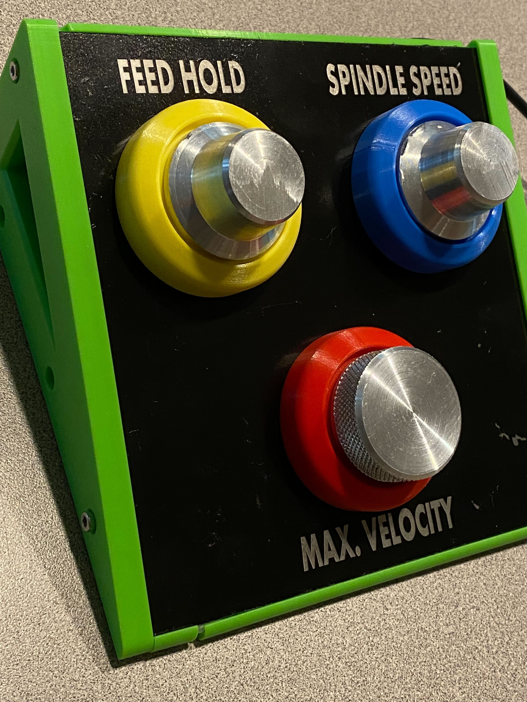

# Intoduction

This device emulates a Tormach controller as a USB device. Tormach should recognize this and
allow you to send events to it to control analog such as Max Velocity, Feed and Splindle speeds,
and some buttons like stop, start, feedhold, etc.

It does this by presenting a special USB HID device, recognized as a Tommach controller.
Data sent to the appropriate endpoint is then interpreted as those knob and button settings.

Use the implemanation as you want - but right now I have it set for 3 rotary encoder knobs
which act as "Feed Hold", "Spindle Speed" and "Max Velocity" knobs. Depresseng the encoder
(buttons) brings these to default states (Max Vel goes to ZERO).

It also presents a serial (TTY/Modem) device for debug



# Quick Install

Just copy the prebuilt .uf2 binary from one one of the releases to the flash drive of your Raspberry Pi2050 Pico.  At the top of the `knobs.c` file you can see the gpios that I use for each control. But if you don't have controll stuff yet, see below under `debugging` to send conrol commands to Tormach directly through debug interface.

# Tormach Setup

(I need to elaborate) - Most Tormach machines will recognise and use this device without any setup. Some may have limits as to how many controlers may be present, so if you have multiple, there may be a tweak needed.

Some devices - Like the (xsTech) are *not* configured by default to work with a USB controller - so this has to be enabled on the Tormach for it to work. To do so:

* Enter CLI by pressing ctrl-alt-x (I think)
* `sudo su` (Get root)
* Look in the `machine.json` file, and see what kind of machine you have
* Find the configuration file (somewhere in this directory - config? tmc/config?) 
* There is a .hal file somewhere called `tormach_control.hal`. It will be referenced by *other* machines. Make sure this HALFILE is configured as-such for *your* machine.

(I can't see my machine right now - so describing that from memory)

# Build
Just install the Raspberry Pi 2025 Pico SDK, clone this repo and do...
```
cd build
cmake -DCMAKE_BUILD_TYPE=Debug  ..
make
```

# Running
As any pico, enter bootsel mode then copy the resulting `.uf2` image to the Pico's media mount:

```
cp pico_tormach.uf2 /media/$USER/RPI-RP2/
```

# Debug HID

## Debug Build
To enable a debug build, uncomment in `CMakeList.txt`:

```
add_compile_definitions(DEBUG)
```

(This is on by default)

Debug builds present a TTY device which you can connect to to get diagnostic output and CLI commands. (Type `help` for commands).

## Debug
```
sudo minicom -b 115200 -o -D /dev/ttyACM0
```
When you install  `dmesg` will show something like:

`hid-generic 0003:16C0:048F.000F: input,hidraw0: USB HID v1.11 Device [Tormach Console Controller] on usb-0000:00:14.0-1/input0`

You can get output by dumping the appropriate raw HID devices:

`xxd /dev/hidraw0`


Use a terminal program like minicom or something to send commands. Use `help` to see commands. 

This is the most useful one for example:

```
raw 1 00 01 22 02 33 03
```

This will send raw data to endpoint "1" (tormach knob HID). Fist byte is buttons, next (LSB) words are the three knobs. 


## Quick enter Bootsel mode
```
sudo stty -F /dev/ttyACM0 115200 cs8 cread clocal -ixon -ixoff
echo -e "bootsel\n" | sudo cat > /dev/ttyACM0
```

The first line keeps the flow control open during the command. The second tells the CLI to enter "bootsel" mode. You can also use this to send other CLI commands (like the "raw" example above) to the device.
